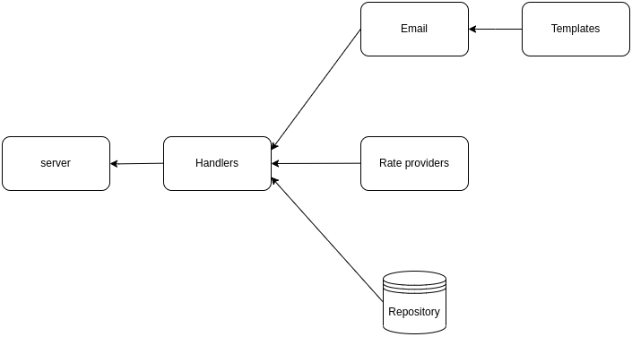

# btc-test-task

The project consists of several main parts:
 - Server
 - Configuration
 - Services

---

Server is composites of go-chi `Router` and respectively sets handlers for all required endpoints. Handlers are created using `HandlersFactory` which itself is an interface. But also has implementation that sets all handlers.

---

Configuration is a simple struct that contains all required configuration information. It is passed to all components under their Init method
Configuration has one method `LoadFromENV` to load all configuration information from `.env` file.

---

There are 4 services:
 - Templates
 - RateAccessor
 - EmailStorage
 - EmailSender

All of these 4 services are interfaces and have appropriate implementations.
Templates module is responsible for creating email parametrized templates, that will be sent to user.
RateAccessor is responsible for accessing currency rate.
EmailStorage is responsible for managing and saving email addresses.
EmailSender is responsible for sending emails to users.

---

## Launch project using docker compose
```bash
docker compose up
```
as specified in docker-compose.yml, the server will serve on port 2777

## Endpoints
 - `GET` `/api/rate` - get current rate between currencies specified in .env file
 - `POST` `/api/subscribe` - send form value 'email' to subscribe to mailing list
 - `POST` `/api/sendEmails` - send current rate to all subscribed emails


## Architecture
